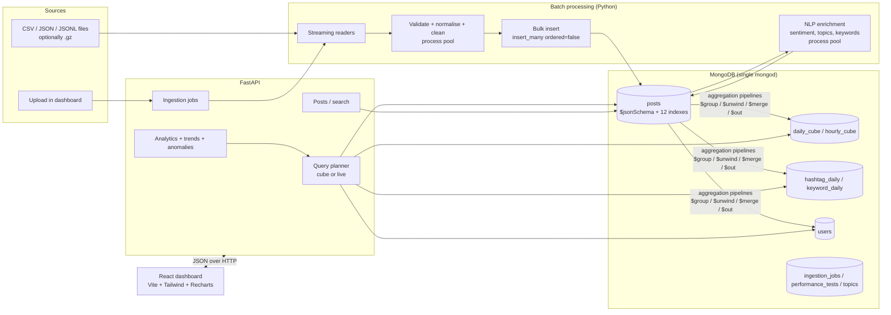

# Architecture

## Overview

The system is a **batch analytics pipeline on a single machine**. MongoDB is the system of record and also the
compute engine for aggregation: Python never pulls the whole collection into memory. There is no message queue,
no streaming and no cluster; see *Scaling* below for what would change at larger scale.

## Components

### 1. Ingestion (`backend/app/ingestion/`)

1. `readers.py` streams records from CSV, JSONL or JSON (optionally gzipped) one at a time. Malformed JSON lines
   become `__parse_error__` records so they are counted, not fatal.
2. `normalize.py` maps a source *profile* (`ira538` or `generic`) onto the unified post document and raises
   `InvalidRecord` with a reason (`missing_id`, `empty_text`, `invalid_timestamp`, `parse_error`).
3. `cleaning.py` does the text work: HTML unescape, Unicode NFC, URL / mention / hashtag / emoji extraction,
   retweet-prefix removal, whitespace collapse, quality flags, a text fingerprint for copy-paste detection.
4. `pipeline.py` groups records into chunks, cleans them in a process pool (`fork` on Linux/macOS, `spawn` on
   Windows), and the parent bulk-inserts each batch with `insert_many(ordered=False)`. Duplicate keys
   (error 11000) are counted from the `BulkWriteError` instead of being checked in Python, and memory stays
   bounded to a few batches regardless of file size.
5. Each run is recorded in `ingestion_jobs` with all counts and cleaning statistics.

### 2. NLP enrichment (`backend/app/nlp/`)

`enrich.py` reads unprocessed posts through the partial index on `processed: false`, runs sentiment
(English) and topic + keyword extraction (English, Russian) in worker processes, and writes results back with
bulk `UpdateOne` operations. Models are trained once by `scripts/train_sentiment.py` and `scripts/train_topics.py`
and saved with joblib.

### 3. Rollups (`backend/app/analytics/rollups.py`)

Five aggregation pipelines materialise summary collections from `posts`:

| Collection | Grain | Feeds |
| --- | --- | --- |
| `daily_cube` | day x language x country x sentiment x topic | almost every dashboard chart |
| `hourly_cube` | hour x language x sentiment | hourly charts, weekday x hour heatmap |
| `hashtag_daily` | day x hashtag | hashtag trends, top hashtags |
| `keyword_daily` | day x language x keyword | keyword trends |
| `users` | account | account behaviour |

A full rebuild ends each pipeline with `$out` (bulk write of a new collection, then index build). After an
upload, only the affected days are recomputed with `$merge` (upsert on the cube's unique key).

### 4. API (`backend/app/api/`, `backend/app/analytics/`)

* `source.py` holds the `Filters` model shared by every endpoint and the **query planner**: if a request only
  filters on dimensions the cube has (date, language, country, sentiment, topic), it reads `daily_cube`;
  if it needs anything else (hashtag, free text, engagement threshold, user, retweet exclusion) it runs the same
  aggregation live on `posts`. `mode=live|cube|auto` lets the Performance page and the experiments force either.
* `queries.py` contains one function per page; each is one or a few aggregation pipelines (`$facet` is used to
  compute several breakdowns in one pass).
* Results are cached in-process for 120 seconds (TTL LRU cache) and the cache is cleared when an ingestion job
  finishes.
* `anomalies.py` computes rolling statistics in MongoDB (`$setWindowFields`) and runs IQR and Isolation Forest on
  the resulting daily series in Python (about 1,700 rows).

### 5. Dashboard (`frontend/`)

React 19 single-page app. Each page is a lazily loaded chunk. Global filters live in the URL query string, so
any view can be bookmarked or shared. `useApi` aborts the previous request when filters change and exposes a manual retry. Every chart is wrapped
in a component that renders loading skeletons, error-with-retry and empty states. Colours come from CSS tokens
with separate light and dark values.

## Why this design

| Decision | Reason | Trade-off |
| --- | --- | --- |
| MongoDB documents for posts | Posts are naturally nested (user, location, engagement, sentiment, topic) and arrays (hashtags, mentions, keywords) are first-class, with multikey indexes. Different sources can carry different fields without migrations | No joins across large collections; aggregation must be designed around the document shape |
| Pre-aggregated rollups | Dashboard charts read 130K cube rows instead of 2.9M posts; measured speed-ups are in [performance.md](performance.md) | Rollups must be refreshed after new data arrives (done per affected day) and cannot answer every filter |
| Batch, not streaming | The data is a historical archive; batch jobs are simpler to test and measure | No live updates; a new upload becomes visible after its job finishes |
| scikit-learn NLP | Runs on a CPU at tens of thousands of texts per second, fits in a 16 GB laptop | Lower accuracy than transformer models |
| Deferred index build | Inserting into 12 indexes during a bulk load is slower than building them afterwards (experiment 4) | The collection is not fully indexed until the build finishes |
| In-process cache | No extra service to install | Not shared between API worker processes |

## Scaling

What exists: batching, process-level parallelism on one machine, server-side aggregation, rollups, indexes.

What would be needed for much larger data (not implemented): a replica set for availability, sharding `posts`
on a key such as `{created_at: "hashed"}` or a compound of date and source so aggregations run on several shards
in parallel, a job queue (for example Celery or RQ) instead of in-process threads for ingestion jobs, and a shared
cache such as Redis. MongoDB's aggregation pipelines used here run unchanged on a sharded cluster, except that
`$out`/`$merge` targets and `$lookup` have sharding-specific rules that would need checking.
