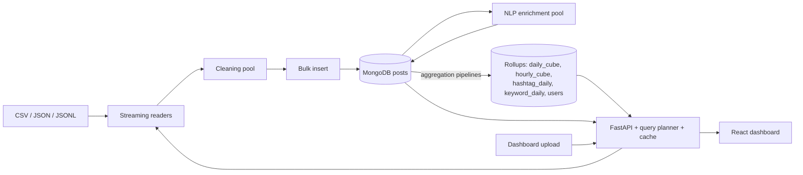
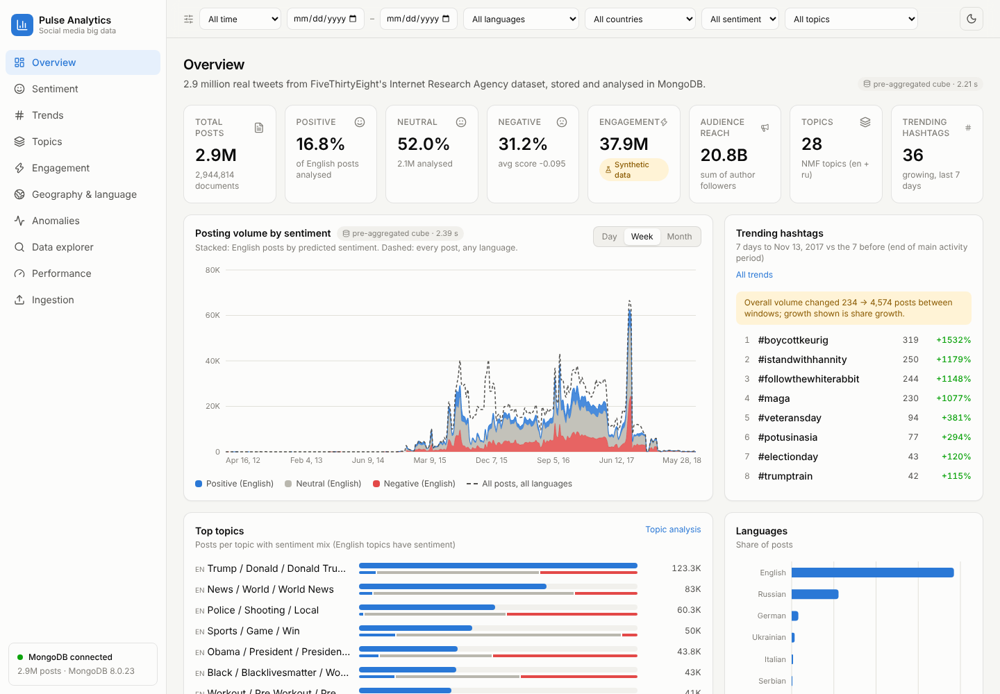

# Large-Scale Social Media Sentiment and Trend Analytics Using MongoDB

Report material, organised in the 25 sections required by the course. Text can be copied into the final report
and expanded; every number is taken from the running system or from [performance.md](performance.md), and
section 20-21 numbers must be refreshed if the experiments are re-run on another machine.

---

## 1. Abstract

Social media platforms produce large volumes of short, noisy, multilingual text whose patterns cannot be found by
reading individual posts. This project builds a complete batch analytics platform for such data on a single
16 GB machine, with MongoDB as both the storage layer and the main computation engine. 2,944,814 real tweets from
the FiveThirtyEight / Clemson University dataset of Internet Research Agency accounts are streamed, validated,
cleaned and bulk-loaded into a schema-validated MongoDB collection with twelve purpose-built indexes. Lightweight
CPU-based NLP adds sentiment (TF-IDF with logistic regression, test macro-F1 0.58 on TweetEval), topics (NMF, 16
English and 12 Russian topics) and keywords. MongoDB aggregation pipelines materialise daily, hourly, hashtag,
keyword and account rollups, which a FastAPI service combines with live aggregation through a simple query
planner. A React dashboard presents sentiment, topics, trends, engagement, geography, anomalies and a searchable
data explorer. Experiments at 100K, 500K, 1M and 2.95M documents measure ingestion throughput, batch size and
parallelism effects, index build strategy, indexed versus collection-scan queries, aggregation scaling, the
benefit of pre-aggregation, and NLP throughput. Engagement counts are absent from the source and are generated
synthetically, and are labelled as such throughout.

## 2. Introduction

Platforms such as Twitter / X carry public conversation at a scale where manual reading is impossible. Analysts
want to know how sentiment changes, which topics and hashtags grow, which days are unusual and which accounts
drive activity. Answering these questions needs three things: storage that copes with semi-structured documents,
processing that does not require all data to fit in memory, and analytics that can be explored interactively.

This project implements those three layers with MongoDB, Python and React, and measures how they behave as data
grows. It deliberately stays on one machine and avoids distributed frameworks, to show which Big Data techniques
(streaming, batching, server-side aggregation, indexing, pre-aggregation, parallelism) already matter at the
scale of a few million records.

## 3. Problem Statement

Given millions of social media posts with timestamps, text and author metadata:

1. ingest them reliably from common file formats without exhausting memory, rejecting invalid and duplicate
   records and reporting what happened;
2. store them so that analytical queries by time, sentiment, topic, language, location and hashtag are fast;
3. derive sentiment, topics, trends and anomalies;
4. present the results through an API and an interactive dashboard;
5. measure how the system performs as the data grows, on hardware a student has.

## 4. Objectives

* Build a batch ingestion pipeline for CSV, JSON and JSONL with validation, cleaning, de-duplication, bulk
  insertion and statistics.
* Design a MongoDB schema, validation rules and indexes justified by the query patterns.
* Implement sentiment analysis, topic extraction, keyword extraction, trend detection, engagement analytics, time
  analysis and anomaly detection, computing aggregates inside MongoDB.
* Expose the analytics through a documented REST API with validation and pagination.
* Build a professional React dashboard with filtering, search and clear handling of loading, error and empty
  states.
* Run and record performance experiments at several data sizes.
* Document limitations honestly, including which data is synthetic.

## 5. Existing System

Typical approaches available to an analyst without a dedicated platform:

* **Native platform analytics** (for example account dashboards) show engagement for one's own account only and
  give no access to cross-account text analysis.
* **Spreadsheets and scripts** (Excel, pandas loading a CSV) work for thousands of rows but need the whole file
  in memory, have no indexes and must recompute every statistic from scratch.
* **Relational databases** can store posts, but hashtags, mentions and nested metadata require several joined
  tables and schema changes for new sources.
* **Cluster frameworks** (Hadoop, Spark) handle very large data but need a cluster or substantial setup; they were
  excluded by the brief and are unnecessary at this scale.
* **Commercial social listening tools** are capable but closed, paid, and do not expose their methods for
  academic evaluation.

The gap: an open, reproducible, single-machine system that handles millions of posts, keeps the processing close
to the data, and documents and measures its own methods.

## 6. Proposed System

A layered batch analytics platform (see section 8):

* streaming readers and a multi-process cleaning pipeline that bulk-loads MongoDB;
* a document schema with server-side validation and indexes chosen per query pattern;
* NLP enrichment written back to the documents;
* aggregation pipelines that materialise rollup collections and refresh only affected days after new uploads;
* a FastAPI service with a query planner that answers from rollups when possible and from live aggregation when
  needed;
* a React dashboard;
* an experiment harness that records every measurement with its hardware.

## 7. Big Data Characteristics

| Characteristic | In this project | Honest qualification |
| --- | --- | --- |
| Volume | 2,944,814 posts; 3.5 GB uncompressed BSON (1.1 GB on disk) plus 1.0 GB of indexes in `posts`; 4.4M rows in the keyword rollup | large for a laptop, small for industry |
| Variety | free text in 56 language values, emoji, URLs, nested author metadata, arrays of entities, CSV / JSON / JSONL inputs, optional real engagement in uploads | |
| Velocity | new data arrives through batch ingestion jobs; rollups refresh incrementally | no real-time stream; velocity is simulated by uploads |
| Veracity | duplicate ids, empty posts, missing language and location, spam-like posts, a collection gap, timestamps without time zone | handled by validation, flags and documented assumptions |
| Value | trends, anomalies and sentiment patterns not visible from individual posts | findings describe a troll-account archive, not the public |

## 8. Architecture

Components and design decisions are described in [architecture.md](architecture.md). Key decisions: MongoDB is
the system of record and the aggregation engine; dashboard queries read pre-aggregated rollups when the filters
allow; processing is batch-oriented and parallel within one machine.

## 9. Technology Stack

| Layer | Technology (version used) | Why |
| --- | --- | --- |
| Database | MongoDB 8.0.23 Community, WiredTiger | document model, multikey indexes, aggregation framework |
| Driver | PyMongo 4.18 | official driver, bulk operations, aggregation |
| Backend | Python 3.13, FastAPI 0.142, Pydantic 2.13, Uvicorn | typed validation, automatic OpenAPI docs |
| NLP / ML | scikit-learn 1.9 (TF-IDF, logistic regression, Naive Bayes, NMF, Isolation Forest), vaderSentiment 3.3.2, NumPy 2.5 | CPU-only, fast, well understood |
| Reporting | pandas 3.0 (experiment report generation) | tabulating measured results |
| Frontend | React 19, Vite 8, Tailwind CSS 4, Recharts 3, React Router 7, lucide-react | modern component UI, fast builds, declarative charts |
| Testing | pytest 9, FastAPI TestClient, Vitest 5, Testing Library, ruff, oxlint | |

Not used, by design: Spark / PySpark, Streamlit (excluded by the brief), GPUs, transformer models.

## 10. Dataset

See [dataset.md](dataset.md) for full details.

* **Source:** FiveThirtyEight `russian-troll-tweets`, collected by Linvill and Warren (Clemson University),
  CC BY 4.0. Tweets from accounts Twitter linked to the Internet Research Agency.
* **Size:** 2,946,207 rows read, 2,944,814 stored, 2,843 accounts, 2012-02-02 to 2018-05-30 (99.5% in
  2015-2017).
* **Fields used:** text, publish date, language, account region, author, followers / following, account category
  and type, post type.
* **Missing:** sentiment labels (predicted by a model trained on TweetEval), engagement counts (generated
  synthetically and flagged), time zone (UTC assumed), city-level location.
* **Representativeness:** the accounts are a state-linked influence operation; results do not describe public
  opinion.

## 11. MongoDB Design

See [database.md](database.md).

* **Collections:** `posts` (2.94M), five rollups (`daily_cube` 130K, `hourly_cube` 171K, `hashtag_daily` 418K,
  `keyword_daily` 4.4M, `users` 2.8K), `topics`, `ingestion_jobs`, `performance_tests`.
* **Document model:** user, location, engagement, sentiment and topic embedded as sub-documents; hashtags,
  mentions and keywords as arrays; original and cleaned text both kept.
* **Validation:** `$jsonSchema` with required fields and BSON types, `validationAction: error`.
* **Indexes:** unique `post_id`; date; compound (sentiment, date), (language, date), (country, date),
  (hashtags, date), (topic, date), (user, date desc); text-hash; partial index on unprocessed posts; sparse
  engagement index; text index. Compound indexes follow the equality-sort-range rule.
* **Aggregation:** `$match`, `$group`, `$project`, `$sort`, `$limit`, `$unwind`, `$lookup`, `$facet`,
  `$setWindowFields`, `$dateTrunc`, `$merge`, `$out`.

## 12. Data Preprocessing

Steps (details in [methodology.md](methodology.md#1-text-cleaning)): streaming read; validation of id, text and
timestamp; normalisation of language names to ISO codes and of unknown locations to null; HTML unescape and
Unicode normalisation; extraction of hashtags, mentions, URLs and emoji; removal of retweet prefixes, URLs,
mentions, emoji and control characters; quality flags; text fingerprint; batch bulk insert with server-side
duplicate rejection.

Results of the full ingestion run (from the `ingestion_jobs` record):

| Statistic | Value |
| --- | ---: |
| Records read | 2,946,207 |
| Inserted | 2,944,814 |
| Duplicates (same `tweet_id`) | 1,392 |
| Invalid (empty text) | 1 |
| Hashtags extracted (distinct per post, summed) | 1,753,395 |
| Mentions extracted (distinct per post, summed) | 1,153,675 |
| URLs removed | 2,827,842 |
| Emoji removed (distinct per post, summed) | 93,108 |
| Posts without language | 8,320 |
| Posts without location | 570,812 |
| Flagged: link only / mention stuffing / short / hashtag stuffing / no text left / repetitive | 123,874 / 104,415 / 96,748 / 39,176 / 32,125 / 1,068 |
| Time (4 worker processes, batch 5,000) | 316.3 s, 9,314 records/s |

## 13. Sentiment Analysis

Three-class sentiment for English posts. Three approaches were compared on the official TweetEval splits:
VADER (lexicon), TF-IDF + Multinomial Naive Bayes, TF-IDF + logistic regression with the regularisation strength
chosen on the validation split. Selection by validation macro-F1 picked logistic regression.

Measured on the TweetEval test split (12,284 tweets), from `experiments/results/sentiment_evaluation.json`:

| Model | Test macro-F1 | Test accuracy | Test macro recall |
| --- | ---: | ---: | ---: |
| VADER | 0.526 | 0.528 | 0.564 |
| TF-IDF + Naive Bayes | 0.455 | 0.539 | 0.502 |
| TF-IDF + logistic regression | **0.582** | **0.586** | **0.593** |

For context, the TweetEval repository reports 62.9 macro recall for its SVM and FastText baselines and around 73
for transformer models; this project's model is below them. Applied to the 2,111,943 English posts it predicts
16.8% positive, 52.0% neutral and 31.2% negative. These are model outputs on out-of-domain text; their accuracy
on this dataset has not been measured.

## 14. Topic Analysis

TF-IDF (1-2 grams) and non-negative matrix factorisation, one model per language, trained on 200,000 sampled
posts each: 16 English and 12 Russian topics, labelled by their top terms (for example "Trump / Donald / Donald
Trump", "Police / Shooting / Local", "Black / Blacklivesmatter / Women", "сша / трамп / обама"). A post is
assigned its strongest topic if the weight is at least 0.02; 66% of English and 75% of Russian posts fall below
that threshold and are reported as unassigned. Topic frequency, share, timeline, sentiment mix, engagement and
30-day growth are computed from the daily cube. The number of topics was chosen by inspection, not by a coherence
metric.

## 15. Trend Detection

Window-over-window comparison over the daily hashtag, keyword and topic rollups, with
`trend score = log10(1 + now) x log2((now + 5) / (before + 5)) x (1 + 0.1 x log10(1 + avg reach))`, growth %
and share growth %. A warning is raised when total volume changes more than threefold between the windows.
Example: for the week ending 2016-11-08, `#trumpforpresident` rose from 1 to 1,682 posts (score 34.8), followed by
`#sometimesitsokto`, `#2016electionin3words`, `#electionday` and `#hillaryforprison2016`.

## 16. Engagement Analytics

Totals of likes, comments and shares, engagement per 1,000 followers, engagement over time, by sentiment, by
topic, and top posts (via a sparse descending index). **All engagement values in this dataset are synthetic**,
generated from follower counts only (see [methodology.md](methodology.md#6-synthetic-engagement)), so the module
demonstrates the pipeline and the queries, not real audience behaviour. Uploaded datasets with real engagement
columns are analysed with the same code and flagged `synthetic: false`.

## 17. Anomaly Detection

Three methods on the daily series: a rolling 28-day z-score computed in MongoDB with `$setWindowFields` (volume
and negative share, minimum 100 posts), the IQR rule, and an Isolation Forest on four daily features. On the full
dataset with |z| >= 3, 128 of 1,699 days are flagged by at least one method. The largest volume spike, 2016-10-06
(18,634 posts against an expected 3,483, z = 7.1), is flagged by both the z-score and IQR rules; 2015-11-15 is
flagged by three methods (volume spike, negativity surge, IQR).

## 18. API

26 FastAPI endpoints ([api.md](api.md)): health, filter metadata, overview, time series, activity heatmap,
sentiment, topics, trends, hashtags, engagement, geography, languages, anomalies, accounts, paginated posts,
full-text search, post detail, upload, start ingestion, job list and detail, file preview, and four performance
endpoints including live `explain()`. Shared Pydantic filter validation (422 on bad input), MongoDB error
handlers (503 / 500 without connection details), pagination limits, gzip compression and a 120-second response
cache.

## 19. React Dashboard

Ten pages: Overview, Sentiment, Trends, Topics, Engagement, Geography & language, Anomalies, Data explorer,
Performance, Ingestion. Global filters (date presets, language, country, sentiment, topic, hashtag) are stored
in the URL. Every chart shows which collection answered and how long it took, has loading skeletons, error
states with retry, and empty states. Synthetic engagement is badged on every view. Light and dark themes, a
collapsible sidebar and filter bar on phones, lazily loaded pages. Charts follow a colour-blind-checked palette
with fixed category order.

## 20. Performance Experiments

Set-up, method and complete tables: [performance.md](performance.md) and [methodology.md](methodology.md#8-timing-methodology-experiments).

Experiments:

1. ingestion scaling at 100K, 500K, 1M and 2.95M posts;
2. batch size (100 to 20,000);
3. number of cleaning worker processes (1, 2, 4);
4. building secondary indexes during or after the load;
5. six representative queries with and without their index, using `explain("executionStats")`;
6. six aggregation pipelines at each size, rollup versus live answers for five dashboard queries, and the full
   rollup rebuild;
7. NLP model throughput and the end-to-end enrichment job with 1, 2 and 4 workers.

The 5M size was not run: the real dataset has 2.95M posts and was not padded with synthetic data.

## 21. Results

All numbers below were measured on one cloud virtual machine (Intel Xeon @ 2.80 GHz, 4 vCPUs, 15.7 GB RAM,
MongoDB 8.0.23 with a 4 GB WiredTiger cache, Python 3.13) on 2026-10-08. Full tables, parameters and run notes:
[performance.md](performance.md). Timings are medians of three runs unless stated.

**Ingestion scales linearly.** Throughput stayed between 9,916 and 11,815 records/s from 100K to 2.95M posts, so
load time grew in proportion to data size: 9.1 s for 100K, 91 s for 1M, 297 s for 2.95M, plus 311 s to build the
secondary indexes on the full collection (608 s in total).

| Posts | Load (s) | Records/s | Index build (s) |
| ---: | ---: | ---: | ---: |
| 100,000 | 9.1 | 10,992 | 9.5 |
| 500,000 | 42.3 | 11,815 | 46.9 |
| 1,000,000 | 91.0 | 10,992 | 99.1 |
| 2,944,814 | 297.1 | 9,917 | 310.9 |

**Batch size.** On 300,000 records, batches of 100 documents gave 7,909 records/s; 500 to 20,000 gave 11,184 to
11,795 records/s. Very small batches pay a round trip per batch; beyond about 500 the gain is small.

**Parallel cleaning.** One worker process gave 6,963 records/s, two gave 13,284 (1.9x), four gave 11,526. With
4 vCPUs shared by the workers, the inserting parent process and `mongod`, two workers were the best setting on this
machine.

**Index build timing.** Loading 300,000 records with all 12 secondary indexes in place took 68.1 s; loading with
only the unique index and building the rest afterwards took 27.9 s + 29.3 s = 57.3 s (16% less in total).

**Indexes versus collection scans (2.94M posts).** A collection scan examined all 2,944,814 documents and took
3.2 to 5.0 s. With the matching index each query examined only the documents it returned:

| Query | Scan (ms) | Indexed (ms) | Documents examined with index |
| --- | ---: | ---: | ---: |
| negative posts in October 2016 | 4,955 | 201 | 33,703 |
| posts with one hashtag | 3,454 | 64 | 16,172 |
| one language in a date range | 3,412 | 122 | 28,734 |
| one country in a date range | 3,181 | 72 | 27,178 |
| posts of one day | 3,394 | 22 | 7,365 |
| latest 50 posts of one account | 3,256 | < 1 | 50 |

Scan time grew with collection size (for example 518 ms at 500K, 1,404 ms at 1M and 4,955 ms at 2.94M for the
first query) while indexed time followed the number of matching documents.

**Aggregation pipelines grow linearly with data.** Each full-collection pipeline took about 0.2 to 0.9 s on 100K
posts and 6.2 to 27.1 s on 2.94M posts (for example the sentiment distribution: 0.77 s, 3.19 s, 7.22 s, 21.26 s at
100K, 500K, 1M, 2.94M).

**Pre-aggregation gives the largest gain for the dashboard.** The same queries answered from the `daily_cube`
rollup instead of `posts`:

| Dashboard query | Live on posts (s) | From rollup (s) | Speed-up |
| --- | ---: | ---: | ---: |
| Overview KPIs | 33.7 | 0.96 | 35x |
| Sentiment page | 31.5 | 0.87 | 36x |
| Topics page | 36.7 | 0.83 | 44x |
| Geography page | 25.6 | 0.69 | 37x |
| Overview, English 2016 | 14.4 | 0.42 | 34x |

The price is the rollup build: 470 s for a full rebuild of all five rollups, of which 333 s is the 4.4M-row
keyword rollup. After an upload only the affected days are recomputed.

**NLP throughput.** On 20,000 English posts: logistic regression sentiment 24,067 texts/s, VADER 17,767 texts/s,
NMF topics plus keywords 25,677 texts/s. The end-to-end enrichment job (read, both models, bulk write) processed
200,000 posts at 5,213 posts/s with one worker and 10,355 posts/s with two; with two or more workers about 16 s of
the 19 s were spent waiting on database writes, so writes, not models, became the limit. At the two-worker rate,
enriching all 2.94M posts would take about 5 minutes (extrapolated, not measured as one run).

**Sentiment model.** Validation macro-F1: logistic regression 0.650, VADER 0.560, Naive Bayes 0.506. Test
macro-F1 0.582, accuracy 0.586, macro recall 0.593.

## 22. Limitations

* **Single machine.** No sharding, replication or distributed processing; scaling beyond one server is
  discussed, not implemented.
* **Batch, not real time.** New data becomes visible after its ingestion job and rollup refresh.
* **Dataset.** Troll-account archive, not representative; time zone assumed; account-level location only.
* **Synthetic engagement.** No real likes, replies or shares exist in the source.
* **Sentiment.** English only; test macro-F1 0.58 on TweetEval, below published baselines; not validated on
  this dataset; no sarcasm or context handling.
* **Topics.** Two thirds of posts unassigned at the chosen threshold; topic count chosen by inspection.
* **Experiments.** One cloud virtual machine with 4 vCPUs; warm cache only; 5M size not run; each timing is a
  median of three runs, so small differences are within noise.
* **Security.** No authentication on the API: intended for local use.

## 23. Future Scope

* Transformer sentiment models (for example a Twitter-specific RoBERTa) on a GPU, evaluated on a labelled sample
  of the target data.
* Topic count chosen by coherence; BERTopic or embedding-based clustering.
* A replica set and a sharded `posts` collection; measuring aggregation scaling across shards.
* Streaming ingestion with MongoDB change streams feeding incremental rollups.
* A job queue for ingestion and a shared cache (Redis) for multiple API workers.
* Authentication and role-based access for the API.
* Network analysis of retweets and mentions between accounts.
* Running the experiments on several laptops to show hardware sensitivity.

## 24. Conclusion

The project shows that a single 16 GB machine with MongoDB at its core can ingest, enrich, aggregate and serve
analytics over almost three million social media posts. The decisive techniques were the ones the Big Data
course emphasises: streaming instead of loading everything, bulk writes in batches, parallel processing,
building indexes after bulk loads, indexes matched to query patterns, keeping computation inside the database,
and pre-aggregating for interactive use. The experiments quantify each of these. The analytical layer works end to
end, with clear limits: sentiment accuracy is modest and unvalidated on this domain, engagement is synthetic, and
the dataset describes a specific influence operation rather than public opinion. Those limits are stated in the
system itself as well as in this report.

## 25. References

Only sources actually used by the project are listed. Verify formatting against your department's citation style.

1. Linvill, D. L., & Warren, P. L. (2018). *Troll Factories: The Internet Research Agency and State-Sponsored
   Agenda Building.* Working paper, Clemson University. Dataset published by FiveThirtyEight:
   https://github.com/fivethirtyeight/russian-troll-tweets (CC BY 4.0).
2. Barbieri, F., Camacho-Collados, J., Espinosa-Anke, L., & Neves, L. (2020). TweetEval: Unified Benchmark and
   Comparative Evaluation for Tweet Classification. *Findings of EMNLP 2020*. https://github.com/cardiffnlp/tweeteval
3. Rosenthal, S., Farra, N., & Nakov, P. (2017). SemEval-2017 Task 4: Sentiment Analysis in Twitter.
   *Proceedings of SemEval-2017*. https://aclanthology.org/S17-2088/
4. Hutto, C. J., & Gilbert, E. (2014). VADER: A Parsimonious Rule-based Model for Sentiment Analysis of Social
   Media Text. *Proceedings of ICWSM 2014*.
5. Lee, D. D., & Seung, H. S. (1999). Learning the parts of objects by non-negative matrix factorization.
   *Nature*, 401, 788-791.
6. Liu, F. T., Ting, K. M., & Zhou, Z.-H. (2008). Isolation Forest. *Proceedings of IEEE ICDM 2008*.
7. Pedregosa, F., et al. (2011). Scikit-learn: Machine Learning in Python. *Journal of Machine Learning
   Research*, 12, 2825-2830.
8. MongoDB documentation: Aggregation, Indexes (including the ESR guideline), Schema Validation, `$merge`,
   `$setWindowFields`. https://www.mongodb.com/docs/manual/
9. FastAPI documentation. https://fastapi.tiangolo.com/
10. React documentation. https://react.dev/
